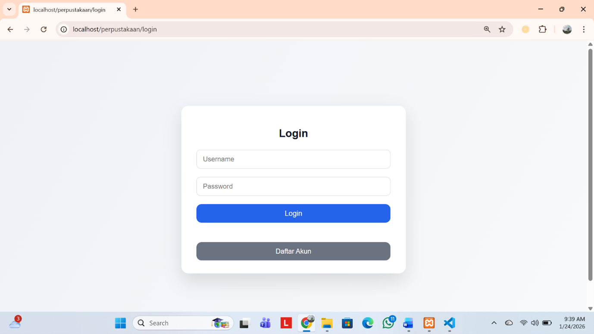
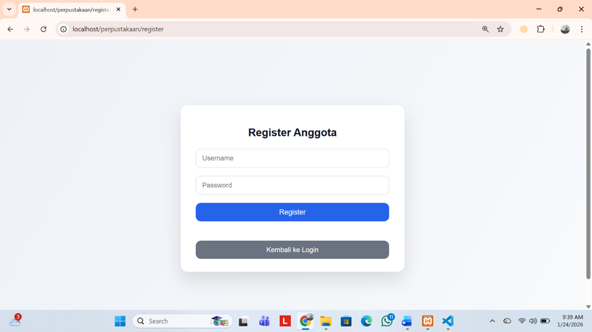
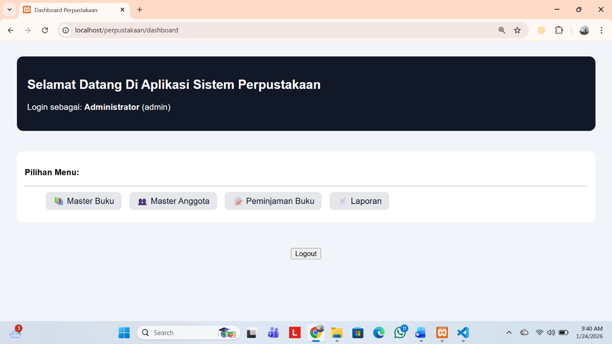
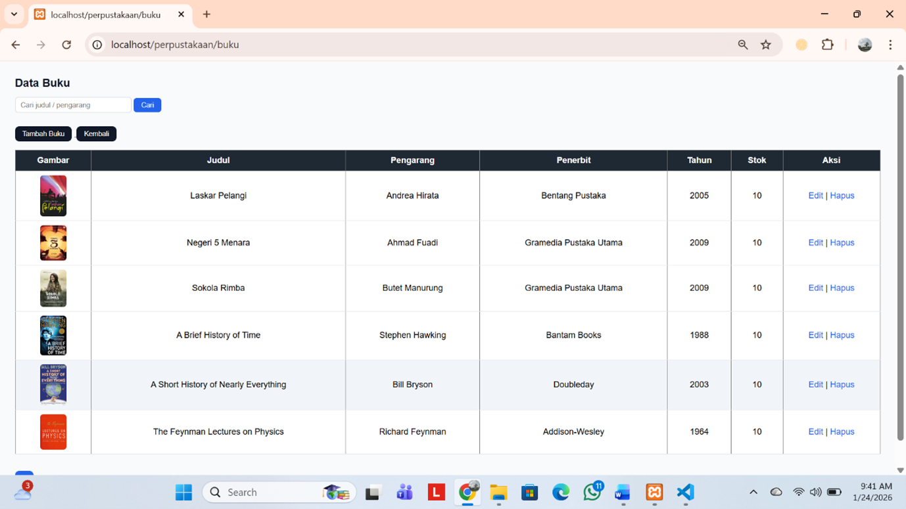
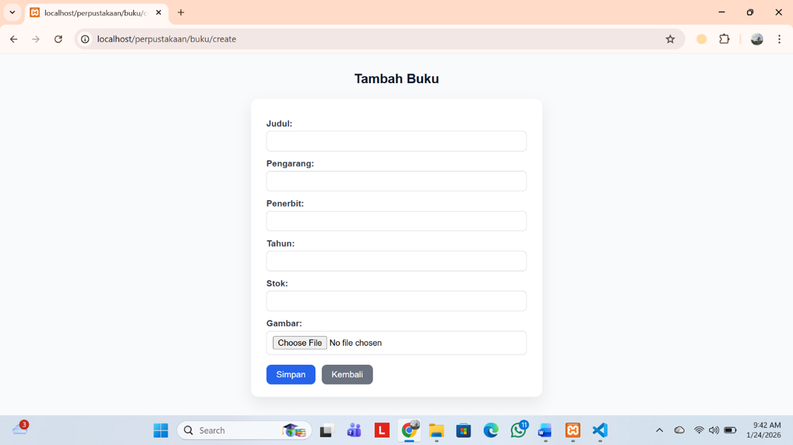
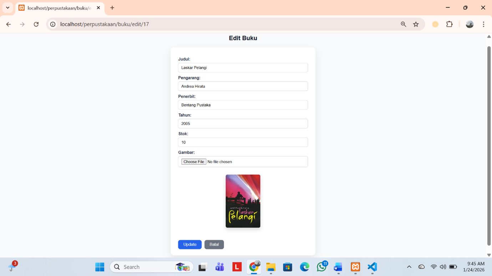
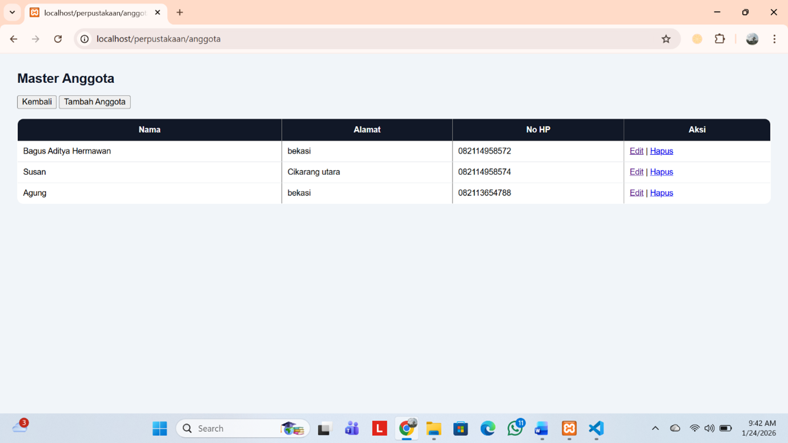
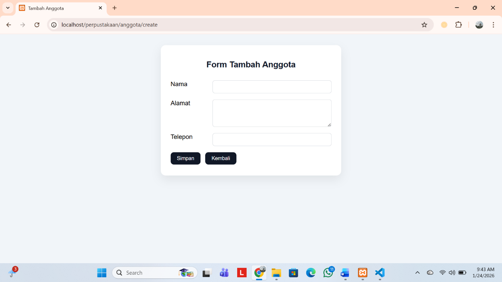
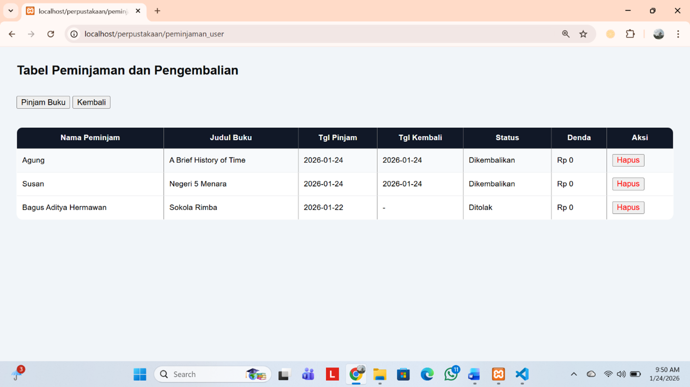
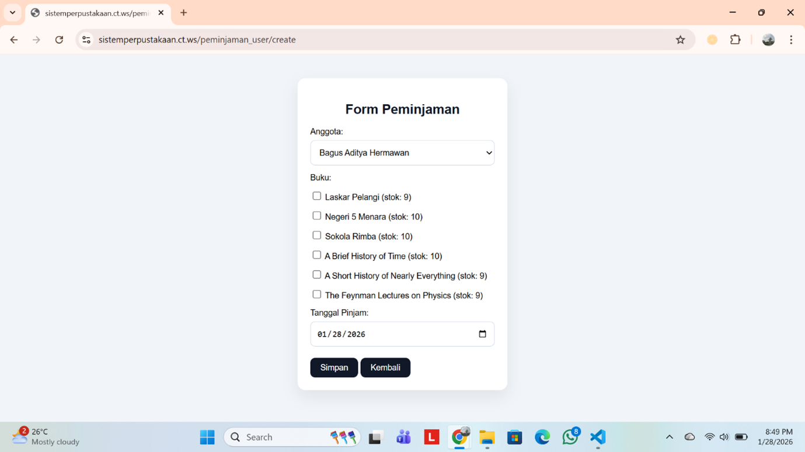

# UAS-Aplikasi Sistem Informasi Perpustakaan
# Nama: Bagus aditya hermawan
# Nim: 312410382
# Kelas: TI.24.A.3

# Penjelasan Tampilan UI/UX
## Halaman login
##### .
Halaman ini untuk validasi terlebih dahulu sebelum masuk kedalam halaman utama dari web perpustakaan ini. wajib mengisi username dan password terlebih dahulu.

## Form registrasi
##### .
From ini untuk user yang belum memiliki akun untuk web ini. user mengisi username dan password yang ingin digunakan. setelah ini disimpan dan kembali ke login.

## Dashboard
##### .
Pada halaman in berisikan pilihan menu yakni master buku, master anggota, peminjaman, dan laporan.

## Master buku
##### .
Halaman master buku berisi daftar data buku yang ada diperpustakaan. terdapat fitur CRUD yang hanya dapat digunakan oleh admin saja.

## Tambah buku
##### .
Halaman tambah buku berisikan form jika admin mendapatkan buku baru.

## Edit buku
##### .
Pada halaman ini berisi form edit buku ketika ada kesalahan dalam pengimputan data buku. misal ada kesalahan dalam input nama buku dll.

## Master anggota
##### .
Halaman master anggota berisi daftar anggota perpustakaan. berisi namam anggota, telepon, dana alamat anggota. terdapat fitur CRUD yang hanya dapat dipakai oleh admin.

## Tambah anggota
##### .
Pada halaman ini admin dapat mengisi form pendaftaran anggota baru yang mendaftar.

## Edit anggota
##### .
Admin dapat mengupdate datan anggota perpustakaan apabila terdapat kesalahan dalam input data.

## Peminjaman
##### .
Pada halaman ini user dapat pinjam buku. terdapat fitur hapus daftar peminjmanan dan pengembalian peminjaman yang hanya dapat dilakukan oleh admin.

## Form peminjaman
##### .
Pada form peminjaman user mengisi nama diri dan memilih daftar buku yang dipinjam dan pilih tanggal peminjaman sesuai waktu yang dipinjam.

## Laporan
Halaman ini memuat tabel riwayat peminjaman buku yang dilakukan oleh anggota perpustakaan.

## Catatan: untuk fitur pengembalian hanya admin yang bisa menggunakannya. dan untuk peminjaman admin harus menambahkan data anggota yang ingin meminjam terlebih dahulu. 
## Untuk username dan password sebagai berikut.
## username: admin
## password: admin123
